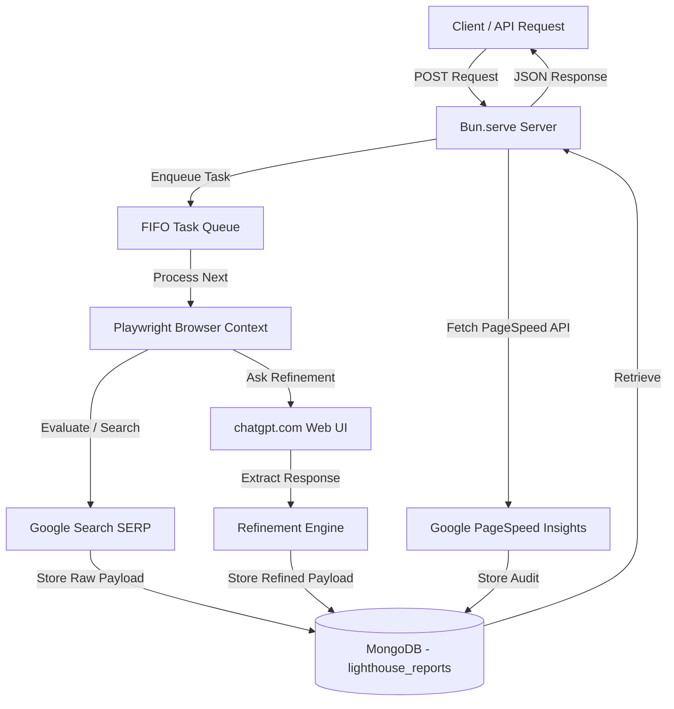

# The Scraper & Audit Platform Documentation Portal

Welcome to the documentation for **The Scraper & Audit Platform**—a high-performance, self-healing browser automation server and analysis engine powered by **Bun**, **Playwright**, **MongoDB**, and **ChatGPT**.

This documentation is split into separate modules for readability and ease of maintenance:

## 📚 Table of Contents

1. [🚀 Getting Started](getting_started.md)
   - System Prerequisites & Dependencies
   - Configuration (`.env`)
   - Reauthentication & Self-Healing Cookies
   - Execution & Command Reference
2. [🔌 API Reference](api_reference.md)
   - HTTP Server Endpoint Index
   - Prompt & Refined Search Schemas
   - PageSpeed Audit endpoints
   - Live curl Examples
3. [⚙️ Engine Reference](engine_reference.md)
   - Persistent Browser Manager & Tabs
   - Standalone Google SERP Scraper
   - AI Refinement & Scorer Pipeline
   - Lighthouse Audit Engine
   - FIFO Concurrency Task Queue

---

## 🏗️ System Architecture

The following diagram illustrates how requests flow through the API server, database, and browser automation layers:



## 📁 Repository Directory Structure

```txt
├── data/
│   └── raw/             # (Deprecated) Filesystem backup directories
├── docs/                # Project Documentation files
│   ├── README.md        # Portal Index
│   ├── getting_started.md
│   ├── api_reference.md
│   └── engine_reference.md
├── reports/             # (Deprecated) Filesystem Lighthouse audit reports
├── src/
│   ├── api/
│   │   └── ask.ts       # HTTP Route handlers, JSON response wrappers
│   ├── browser/
│   │   ├── browser.ts   # Singleton browser context launcher
│   │   ├── cookies.ts   # Dynamic cookie converter and hot-reloader
│   │   └── session.ts   # Interactive browser authenticator CLI
│   ├── chatgpt/
│   │   ├── prompt.ts    # Prompt textarea injector and submission trigger
│   │   ├── extractor.ts # Network SSE interceptor and assistant DOM scraper
│   │   ├── watcher.ts   # Streaming watchdog and completion listener
│   │   └── conversation.ts # Conversation lifecycle manager (Patch archive call)
│   ├── database/
│   │   ├── mongo.ts     # Client connection singleton
│   │   └── models.ts    # Document schemas, constants, and unique indexes
│   ├── queue/
│   │   └── worker.ts    # Concurrency-controlled task queue
│   └── scraper/
│       ├── google.ts    # Google organic SERP pagination scraper
│       ├── refine.ts    # ChatGPT refinement, filtering & score rules
│       └── lighthouse.ts# Lighthouse audit fetcher (PageSpeed API)
├── .env                 # Environment config file
├── index.ts             # Application entrypoint
├── package.json         # Scripts and package manifests
└── tsconfig.json        # TypeScript configuration
```
